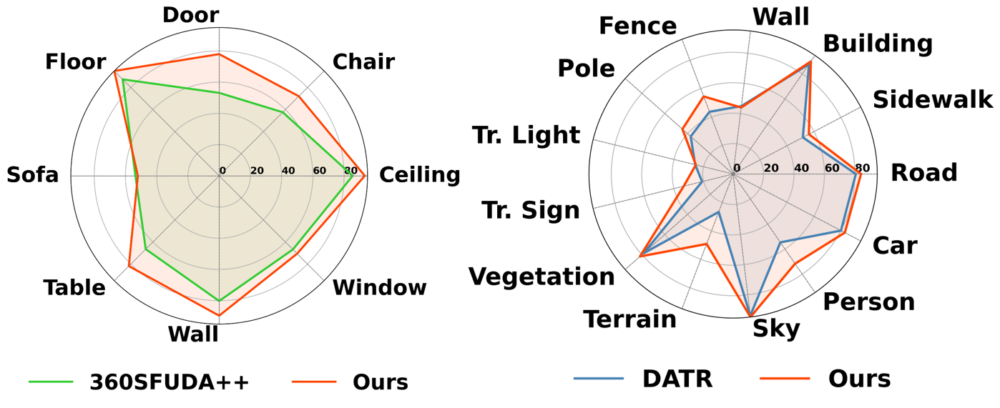
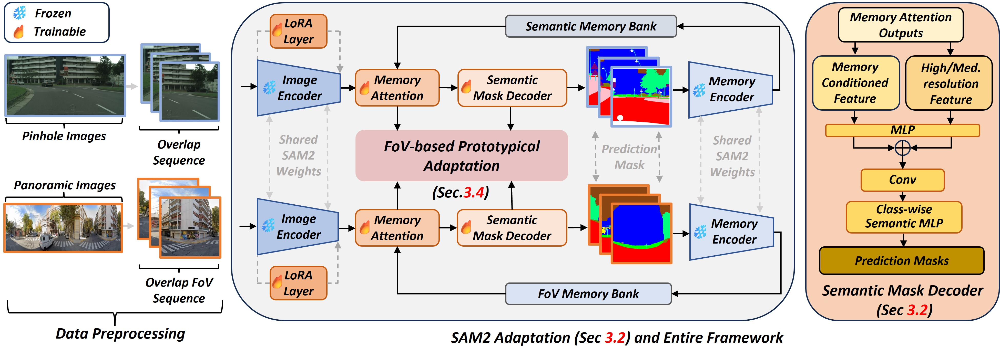

# OmniSAM: Omnidirectional Segment Anything Model for UDA in Panoramic Semantic Segmentation

**Ding Zhong<sup>1,3,*</sup>, Xu Zheng<sup>1,4,*</sup>, Chenfei Liao<sup>1</sup>, Yuanhuiyi Lyu<sup>1</sup>, Jialei Chen<sup>5</sup>, Shengyang Wu<sup>3</sup>, Linfeng Zhang<sup>6</sup>, Xuming Hu<sup>1,2,†</sup>**  
¹AI Thrust, HKUST(GZ), ²CSE, HKUST, ³UMich, ⁴INSAIT, ⁵Nagoya University, ⁶SJTU  
[arXiv:2503.07098](https://arxiv.org/pdf/2503.07098)

---

## Abstract

*Segment Anything Model 2 (SAM2)* has emerged as a strong base model in various pinhole imaging segmentation tasks. However, when applying it to 360° domain, the significant field-of-view (FoV) gap between pinhole (70° × 70°) and panoramic images (180° × 360°) poses unique challenges. Two major concerns for this application include:

1. Inevitable distortion and object deformation brought by the large FoV disparity between domains.
2. The lack of pixel-level semantic understanding that the original SAM2 cannot provide.

To address these issues, we propose a novel **OmniSAM** framework, which makes the *first attempt* to apply SAM2 for panoramic semantic segmentation.
Specifically, to bridge the first gap, OmniSAM first divides the panorama into sequences of patches. These patches are then treated as image sequences in similar manners as in video segmentation tasks. We then leverage the SAM2’s memory mechanism to extract cross-patch correspondences that address the cross-FoV dependencies, improving feature continuity and prediction consistency along mask boundaries.
For the second gap, OmniSAM fine-tunes the pretrained image encoder and reinitializes the mask decoder for semantic prediction. An FoV-based prototypical adaptation module with dynamic pseudo label update mechanism is also introduced to enhance the alignment of memory and backbone features, thereby improving model generalization ability across different sizes of source models.
Extensive experimental results demonstrate that **OmniSAM outperforms the state-of-the-art methods by large margins**, e.g., **79.06% (10.22↑)** on SPin8-to-SPan8, **62.46% (6.58↑)** on CS13-to-DP13.



## Framework


## Preparation

### 📁 Data
Before getting started, please download the following datasets: 
- [Cityscapes](https://www.cityscapes-dataset.com/) 
- [SynPASS](https://drive.google.com/file/d/1u-5J13CD6MXpWB53apB-L6kZ3hK1JR77/view)
- [DensePASS](https://github.com/chma1024/DensePASS)
- [Stanford2D3D](https://arxiv.org/abs/1702.01105)

Then organize them into the following structure:

    data/
    ├── cityscapes
    │   ├── images
    |   |   ├── test 
    |   |   ├── train
    |   |   └── val
    │   └── segmentation
    |       ├── test 
    |       ├── train
    |       └── val
    ├── Stanford2D3D
    │   ├── area_1
    │   ├── area_2
    │   ├── area_3
    │   ├── area_4
    │   ├── area_5a
    │   ├── area_5b
    │   └── area_6
    ├── SynPASS
    │   ├── img
    │   │   ├── cloud
    │   │   ├── fog
    │   │   ├── rain
    │   │   └── sun
    │   └── semantic
    │       ├── cloud
    │       ├── fog
    │       ├── rain
    │       └── sun
    ├── DensePASS
    |   ├── gtFine
    |   └── leftImg8bit
    └── DensePASStrain
        └── leftImg8bit
    OmniSAM/

### 🔧 Environment Setup
Create a new Conda environment and activate it:

    conda create -n omnisam python=3.10
    conda activate omnisam

Download SAM2's weight and upload it into the `sam/checkpoints` directory.  
   [Facebook Research SAM2 Repository](https://github.com/facebookresearch/segment-anything)

Install dependencies:

    pip install -r requirements.txt

Navigate to the model directory and install:

    cd sam
    pip install -e .


## 📊 Getting Started

Please execute the following commend for source domain model training on multiple gpus:

    torchrun --nnodes=1 --nproc_per_node=2 --master_port=29500 train_ddp.py --batch_size=4 --lr=6e-5 --num_epochs=10 --dataset='Cityscapes' --use_mem_bank --exp_name 'exp1' --backbone 'sam2_l' 

After you obtain a source model, you can use `adapt_sam2.py` for domain adaptation:

    python adapt_sam2.py --lr=1e-5 --batch_size=2 --alpha=0.3 --num_epochs=9 --backbone='sam2_b+' --dataset='cityscapes'

To evaluate our model, please execute the following commend:
 
    python validation.py --batchsize=5 --backbone='sam2_b+' --dataset='DensePASS' --use_mem_bank

## ✅ TODO

- ✅ Release source model training code  
- ✅ Release domain adaptation code for the target domain  
- ⬜ Release the checkpoints for the adapted target domain models  


## Acknowledgement
Thanks to [SAM2](https://github.com/facebookresearch/sam2) team for their amazing work!

## Reference
If you find our work useful in your research, please feel free to cite our paper :)

```bash
@misc{zhong2025omnisamomnidirectionalsegmentmodel,
      title={OmniSAM: Omnidirectional Segment Anything Model for UDA in Panoramic Semantic Segmentation}, 
      author={Ding Zhong and Xu Zheng and Chenfei Liao and Yuanhuiyi Lyu and Jialei Chen and Shengyang Wu and Linfeng Zhang and Xuming Hu},
      year={2025},
      eprint={2503.07098},
      archivePrefix={arXiv},
      primaryClass={cs.CV},
      url={https://arxiv.org/abs/2503.07098}, 
}
```